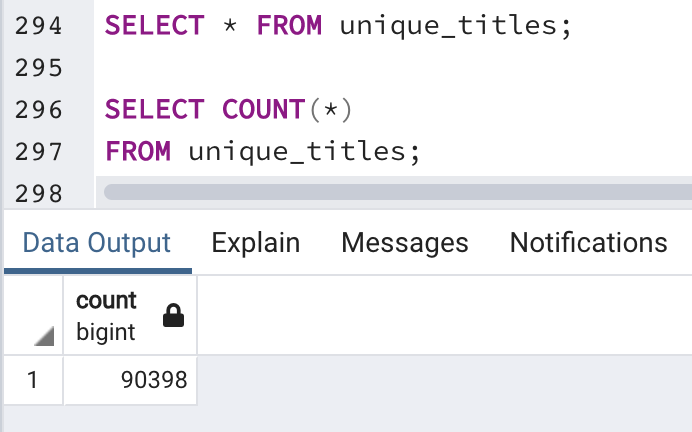
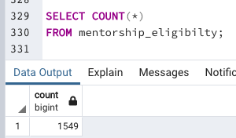

# Pewlett-Hackard-Analysis

## <u>Project Overview</u>

The project consisted in analyzing employee data from Pewlett-Hackard in order to determine the number of retiring employees per title and identify employees who are eligible to participate in a mentorship program. With the analysis, the HR team is going to be able prepare for the "silver tsunami" and plan new mentorship programs accordingly. 

## <u>Results</u>

- After running several queries, the "Retirement Titles" was created in order to show employees eligible for retirement. The table was filtered to only show employees who were born between 1952 and 1955.  

- From the "Retirement Titles" table, it was observed that some employees held various positions during their career in PH, causing duplicate entries for those employees. Therefore, a new table " Unique Titles" was created in order to show the most current and unique titles.

    Retirement titles

    Unique titles

- A table containing all retiring employees by title was made, in order to determine which titles will require new hires. From such table, the title "Senior Engineers" has the highest number of people retiring. Also, there are two leadership positions "Technique Leader" and "Manager" that probably will require a more extensive mentorship program. 

    Retiring by title:

    

- Since there will be seven titles available and the majority of them from engineering areas, the HR department should consider implementing a rotational program for new and internal hires. This will allow employees to get cross functional experience from different organizations.

## <u>Summary</u>
- How many roles will need to be filled as the "silver tsunami" begins to make an impact?

  From "Unique Titles" table, it was calculated that a total number of 90,398 employees are close to retirement. 

- Are there enough qualified, retirement-ready employees in the departments to mentor the next generation of Pewlett Hackard employees?

    From the "Mentorship Eligibility" table, we get that only 1,549 are qualified for this program. This will not be sufficient to fulfill all the available positions. A good idea could be to invest in employee career development to encourage younger generations in order to retain more talent. 

    

## <u>Resources</u>

[SQL Count](https://www.w3resource.com/sql/aggregate-functions/count-function.php)